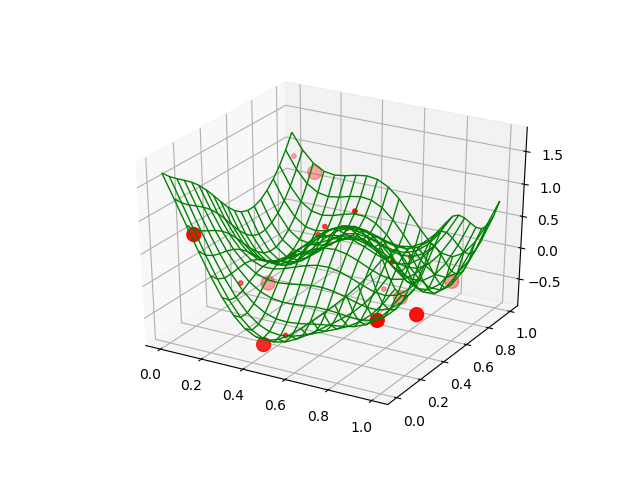

# Example: l1reg_toyprob

* L1-regularized L1-error regression with a gaussian kernel,
  * although a representer theorem cannot be applied
* Trained by 3-dimensional wavy-shaped points
* Regression of 1-dimensional y on 2-dimensional x

## Running this Example

```
$ cargo run --release
$ python plot.py
```



* Larger points: points resulting to have large coefficients
* Curved lines: regression surface

## Formulation

* <a href="https://www.codecogs.com/eqnedit.php?latex=\begin{array}{ll}&space;\text{&space;minimize&space;}_{z,\alpha,\beta,b}&space;&\sum_iz_i&plus;\lambda\sum_i\beta_i\\&space;\text{&space;subject&space;to&space;}&space;&\sum_i\alpha_iK(x_i,x_j)&plus;b-y_j\le&space;z_j\quad(j=1,\ldots,l)\\&space;&-(\sum_i\alpha_iK(x_i,x_j)&plus;b-y_j)\le&space;z_j\quad(j=1,\ldots,l)\\&space;&&space;\alpha_i\le\beta_i\quad(i=1,\ldots,l)\\&space;&&space;-\alpha_i\le\beta_i\quad(i=1,\ldots,l)&space;\end{array}" target="_blank"></a>
* Solved by LP
