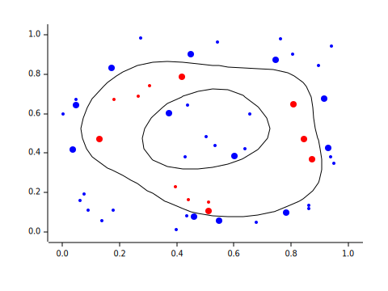
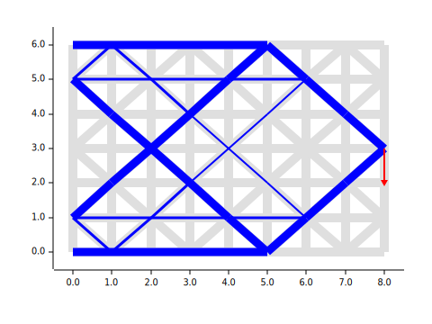
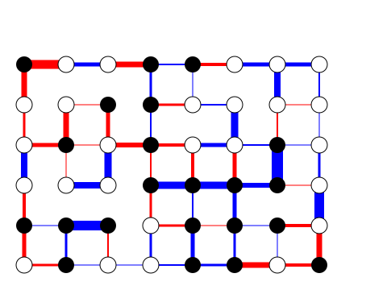

# Example: l1reg_lp

# Example: svm_qp

# Example: trajplan_qcqp

# Example: toruscompl_socp

# Example: partitioning_sdp

# Example: imgnr_udef

* Hatsune Miku by Crypton Future Media, INC. 2007 is licensed under a Creative Commons Attribution-NonCommercial 3.0 Unported License. Based on a work at https://piapro.net/license.
