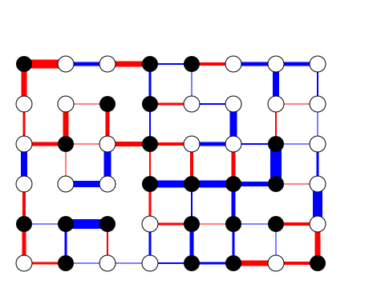

# Example: partitioning_sdp

* Divide nodes of a 2-dimensional planar graph into two groups
* Graph edge weights represent the signed distance  (positive: dissimilarity, negative: similarity) between nodes
* Find a maximum cut (maximum sum of edge weights between nodes of different classification) approximately

## Running this Example

```
$ cargo run --release
```



* Red lines: positive edge weights, the thicker the more dissimilar
* Blue lines: negative edge weights, the thicker the more similar
* Black and white circles: represent the classification of nodes

## Formulation

* 
* Solved by SDP
