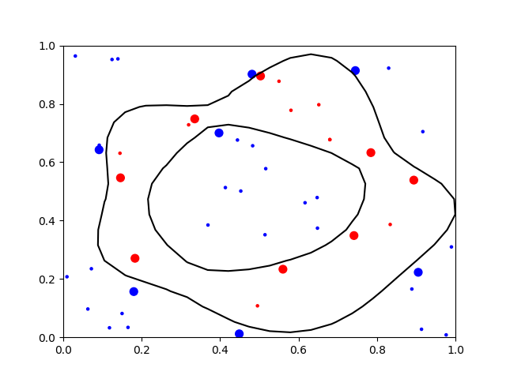

# Example: svm_toyprob

* Hard-margin SVM with a gaussian kernel
* Trained by 2-dimensional ring-shaped labeled points
* Classifying whether a point is inside of the ring or not
* Formulated and solved by QP

## Running this Example

```
$ cargo run --release
$ python plot.py
```



* Larger points: support vectors
* Curved lines: clasification boundary
