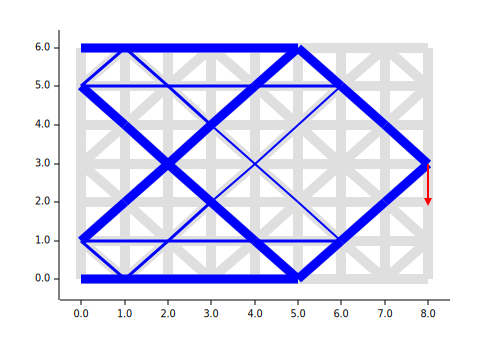

# Example: toruscompl_socp

* Compliance minimization (or stiffness maximization) for a 2-dimensional torus structure
* All the leftmost nodes are fixed, and a downward force (depicted as a red arrow) is applied to one of the rightmost nodes
* Reduce the total volume of the beam members to 1/5 of the original volume

## Running this Example

```
$ cargo run --release
```



* Light gray thick lines: beam members with the original volume.
* Blue lines: beam members as a result of compliance minimization.

## Formulation

* <a href="https://www.codecogs.com/eqnedit.php?latex=\begin{array}{ll}&space;\text{&space;minimize&space;}_{x,q,w}&space;&&space;\mathbf{1}^Tw&space;\\&space;\text{&space;subject&space;to&space;}&space;&&space;w_i&plus;x_i\ge&space;\left\|&space;\left[&space;\begin{matrix}&space;w_i-x_i&space;\\&space;\sqrt{2v_i/E}&space;\end{matrix}&space;\right]&space;\right\|&space;\quad&space;(i=1,\ldots,l)&space;\\&space;&&space;0&space;\le&space;x_i&space;\le&space;1&space;\quad&space;(i=1,\ldots,l)&space;\\&space;&&space;v^Tx&space;\le&space;\frac15v^T\mathbf{1}&space;\\&space;&&space;\sum_{i=1}^l&space;q_i\beta_i=p&space;\end{array}" target="_blank"></a>
* Solved by SOCP
