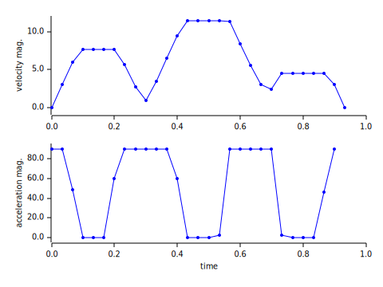

# Example: trajplan_toyprob

* Simple path planning or trajectory planning in 2-dimensional space
* Given four target positions including start and end points
* Choose trajectory minimizing velocity with acceleration limits

## Running this Example

```
$ cargo run --release
$ python plot.py
```


* Trajectory at every time interval
* Red cross points: the target positions



* Time profile of velocity and acceleration magnitude
* Acceleration is kept under limit of 90
* Uniform linear motion is preferred under the constraints of acceleration and target positions

## Formulation

* <a href="https://www.codecogs.com/eqnedit.php?latex=\begin{array}{ll}&space;\text{&space;minimize&space;}_{x}&space;&\sum_t\|v(t)\|^2\\&space;\text{&space;subject&space;to&space;}&space;&\|a(t)\|^2\le&space;A^2\quad^\forall&space;t\\&space;&x(0)=x_s,v(0)=0\\&space;&x(1)=x_t,v(1)=0\\&space;&x(1/3)=x_{m1}\\&space;&x(2/3)=x_{m2}\\&space;\text{&space;where&space;}&space;&v(t)=\frac{x(t&plus;1)-x(t)}{\Delta&space;t}\\&space;&a(t)=\frac{v(t&plus;1)-v(t)}{\Delta&space;t}\\&space;\end{array}" target="_blank"></a>
* Solved by QCQP
