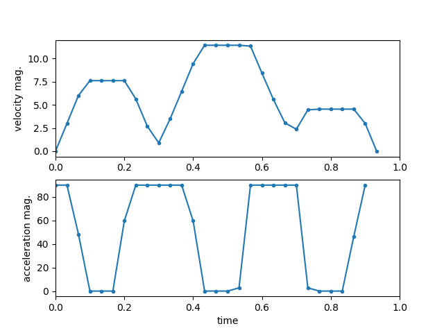

# Example: ctrl_toyprob

* Simple path planning or trajectory planning
* Given 4 target positions including start and end points
* Minimize velocity with acceleration limits

## Running this Example

```
$ cargo run --release
$ python plot.py
```


* Trajectory at every time interval
* Red star points: the target positions



* Time profile of velocity and acceleration magnitude
* Acceleration is kept under limit of 90
* Uniform linear motion is preferred under the constraints of acceleration and target positions

## Formulation

* 
