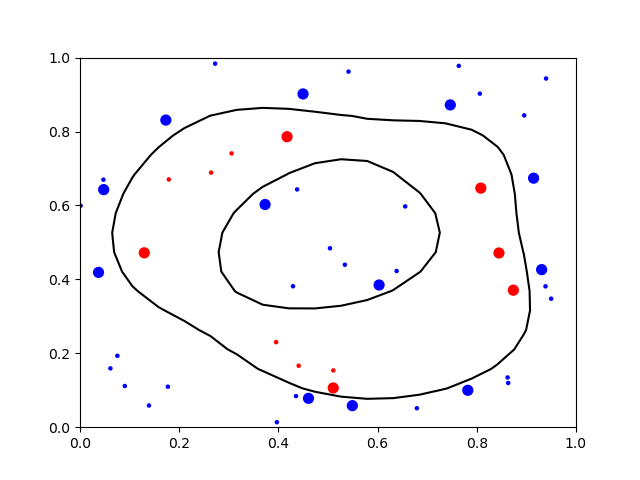

# Example: svm_qp

* Hard-margin SVM with a gaussian kernel
* Trained by 2-dimensional ring-shaped labeled points
* Classifying whether a point is inside of the ring or not

## Running this Example

```
$ cargo run --release
$ python plot.py
```



* Larger points: support vectors
* Curved lines: clasification boundary

## Formulation

* <a href="https://www.codecogs.com/eqnedit.php?latex=\begin{array}{ll}&space;\text{&space;minimize&space;}_\alpha&space;&&space;\frac12\sum_{i,j}&space;\alpha_i\alpha_jy_iy_jK(x_i,x_j)&space;-&space;\sum_i\alpha_i&space;\\&space;\text{&space;subject&space;to&space;}&space;&&space;\sum_i&space;\alpha_i&space;y_i&space;=&space;0&space;\\&space;&&space;\alpha_i&space;\ge&space;0&space;\quad&space;(i=1,\ldots,l)&space;\end{array}" target="_blank"></a>
* Solved by QP
